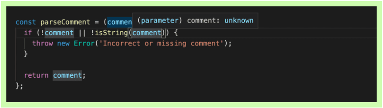
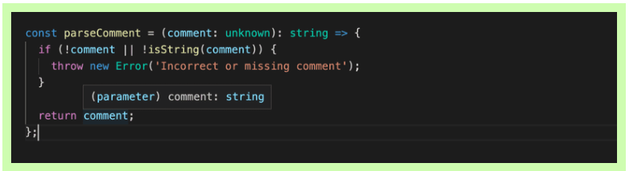

# Typescript

**[Typescript Playground](https://www.typescriptlang.org/play)**

- `Typescript` is a **superset of Javascript**. That means, all Javascript is valid Typescript

## Primary goals of Typescript

1. Provide Javascript developers with an **optional type system**
2. Provide Javascript developers with the ability to utilize planned features from **future Javascript editions** against current Javascript engines

## Typescript type annotation

<details>
<summary>View contents</summary>

> There are 4 primary types in Typescript

1. Implicit
2. Explicit
3. Structural
4. Ambient

### 1. Connivent Implicit Types

- figure out the types of the variables if they are not explicitly defined

```ts
const age = 18; // implicitly, age is number
```

### 2. Explicit Types

- specify the types of the variables

```ts
const age: number = 18;

// function
function sayHello(name: string): string {
  return `Hello ${name}`;
}

// arrow function
const profile = (name: string, age: number): string => {
  return `${name}'s age is ${age}`;
};

// class
class Greeter {
  name: string;

  constructor(name: string) {
    this.name = name;
  }

  sayHello(): string {
    return `Hello ${this.name}`;
  }
}
```

### 3. Structural Types

#### i. Nominal typing:

```ts
class Fruit {}

class Mango extends Fruit {}

class GreenMango extends Mango {}

// Valid, through subtypes
const greenMangoFruit: Fruit = new GreenMango();

// Valid, through subtypes
const mango: GreenMango = new Mango();

// Valid, explicitly defined as a GreenMango
const greenMango: GreenMango = new GreenMango();
```

#### ii. Duck typing

> If it looks like a Duck and it quacks like a Duck. It must be a Duck.

```ts
interface Comment {
  id: number;
  content: string;
}

interface Reply {
  id: number;
  content: string;
  commentId: number;
}

const comment: Comment = {
  id: 1,
  content: "this is a comment",
};

const reply: Reply = {
  id: 2,
  content: "this is a reply",
  commentId: 1,
};

function postComment(comment: Comment) {
  // Do something
}

// Perfect - exact match
postComment(comment);

// Ok - extra information still alright
postComment(reply);

// Error - missing information
// Type '{ id: number; }' is missing the following properties from
// type 'Comment': content
postComment({ id: 1 });
```

### 4. Ambient Types

```ts
// $ is global variable
declare var $: {
  (selector: string): any;
};

$(".cls").show(); // okay
$(123).show(); // Error
```
  
</details>

## Typescript in OOP
  
<details>
<summary>View contents</summary>

```ts
class Point {
  // Instance variables are accessible only through instances of the class.
  // From inside the class, using the this keyword gives us access to the instance variables
  x: number; // instance variable
  y: number;

  constructor(x: number, y: number) {
    // constructor
    this.x = x;
    this.y = y;
  }

  add(point: Point) {
    // method
    return new Point(this.x + point.x, this.y + point.x);
  }
}

class Point3D extends Point {
  z: number;
  // static properties belong to the class themselves,
  // not to instances of the class — objects.
  static instancesCreated = 0; // class variable

  // Readonly properties are properties that can’t be changed once they’ve been set.
  // A read-only property must be initialized at their declaration or in the constructor.
  readonly pointName: string;
  readonly numberOfPoints: number = 5;

  constructor(x: number, y: number, z: number) {
    super(x, y);
    this.z = z;
    Point3D.instancesCreated++;
    this.pointName = "readonlyPoint";
  }

  add(point: Point3D) {
    const point2D = super.add(point);
    return new Point3D(point2D.x, point2D.y, this.z + point.z);
  }
}

const p = new Point3D(0, 10, 20);
console.log(Point3D.instancesCreated);
```
  
</details>

## Access Modifier
  
<details>
<summary>View contents</summary>

> There are 3 access modifiers: public, protected and private

A method or member/attribute with a `public` modifier can access through:

- an instance of the class (object)
- inside the containing class (this)

A method or member/attribute with a `private` modifier can access through:

- inside the containing class (this)

A method or member/attribute with a `protected` modifier can access through:

- inside the containing class and subclasses (this)

| Access modifier | Access from other classes? | Access from subclasses? |
| --------------- | -------------------------- | ----------------------- |
| **public**      | yes                        | yes                     |
| **protected**   | no                         | yes                     |
| **private**     | no                         | no                      |

> by default, the property is public if no access modifier is included

</details>
  
## Interfaces
  
<details>
<summary>View contents</summary>

> Interfaces allow us to declare the structure of classes and variables.

```ts
interface ICenter {
  x: number;
  y: number;
}

interface ICircle {
  readonly id: string;
  center: ICenter;
  radius: number;
  color?: string; // optional property
}

interface ICircleWithArea extends ICircle {
  getArea: () => number; // or, getArea(): number
}

class Circle implements ICircleWithArea {
  // Readonly properties are properties that can’t be changed once they’ve been set.
  // A read-only property must be initialized at their declaration or in the constructor.
  readonly counter: number = 0;
  readonly id: string;
  center: ICenter;
  radius: number;

  constructor(center: ICenter, radius: number) {
    this.id = "";
    this.center = center;
    this.radius = radius;
  }

  getArea() {
    return Math.PI * this.radius * this.radius;
  }
}
```

</details>
  
## Generics

<details>
<summary>View contents</summary>

> Generics offer a way to create reusable components. Generics provide a way to make components work with any data type and not restrict to one data type.

```ts
interface Queue<T> {
  data: T[];
  push: (t: T) => void;
  pop: () => T | undefined;
}

interface Monkey {
  name: string;
  color: string;
}

class MonkeyQueue implements Queue<Monkey> {
  data: Monkey[];

  constructor() {
    this.data = [];
  }

  push(t: Monkey): void {
    this.data.push(t);
  }

  pop(): Monkey | undefined {
    return this.data.shift();
  }
}
```

**Generic Class**

```ts
class KeyValuePair<T, U> {
  private key: T;
  private val: U;

  setKeyValue(key: T, val: U): void {
    this.key = key;
    this.val = val;
  }

  display(): void {
    console.log(`Key = ${this.key}, val = ${this.val}`);
  }
}

let kvp1 = new KeyValuePair<number, string>();
kvp1.setKeyValue(1, "Steve");
kvp1.display(); //Output: Key = 1, Val = Steve
```

**Generics Function**

```ts
type Link<T> = {
  value: T
  next?: Link<T>
}

function createNode<T>(value: T): Link<T> {
  return { value }
}

const createNodeArrow = <T>(value: T): Link<T> => ({ value })
const createNodeArrowAlt = <T extends unknown>(value: T): Link<T> => ({ value })

const node = createNode<string>('wow')
const anotherNode: Link<number> = createNode(2)
const boolNode = createNode(true)
```
  
**Extending Generic**
  
```ts
const greeting = <T extends { name: string }>(obj: T)=>{}

greeting({name: "Foyez", age: 18})
```

In T, must contain { name: string }. Extra properties are also acceptable.
  
```ts
function func<T extends {}>(param: T){}
  
func(8)
func(null) // error
func(undefined) // error
```
  
T extends {} accepts anything but `null` and `undefined`.
  
</details>

## Abstract classes
  
<details>
<summary>View contents</summary>

- `abstract` classes cannot be directly instantiated. Instead, the user must create some class that inherits from the abstract class.
- abstract members cannot be directly accessed, and a child class must provide the functionality.

```ts
type ITrack = { title: string } | null;

abstract class AudioDevice {
  protected isPlaying: boolean = false;
  protected currentTrack: ITrack = null;

  constructor() {}

  play(track: ITrack): void {
    this.currentTrack = track;
    this.isPlaying = true;
    this.handlePlayCurrentAudioTrack();
  }

  abstract handlePlayCurrentAudioTrack(): void;
}

class Boombox extends AudioDevice {
  constructor() {
    super();
  }

  handlePlayCurrentAudioTrack() {
    // Play through the boombox speakers
  }
}
```

</details>
  
## Utility Types <sup>[ref](https://www.typescriptlang.org/docs/handbook/utility-types.html)</sup>
  
<details>
<summary>View contents</summary>
  
### Partial<Type>
  
> Constructs a type with all properties of Type set to optional. 
  
```ts
interface Todo {
  title: string;
  description: string;
}
 
function updateTodo(todo: Todo, fieldsToUpdate: Partial<Todo>) {
  return { ...todo, ...fieldsToUpdate };
}
 
const todo1 = {
  title: "organize desk",
  description: "clear clutter",
};
 
const todo2 = updateTodo(todo1, {
  description: "throw out trash",
});
```
  
### Required<Type>

> Constructs a type consisting of all properties of Type set to required. The opposite of Partial.

```ts
interface Props {
  a?: number;
  b?: string;
}
 
const obj: Props = { a: 5 };
 
const obj2: Required<Props> = { a: 5 }; // Property 'b' is missing in type '{ a: number; }' but required in type 'Required<Props>'.
```
  
### Readonly<Type>

> Constructs a type with all properties of Type set to readonly, meaning the properties of the constructed type cannot be reassigned.

```ts
interface Todo {
  title: string;
}

const todo: Readonly<Todo> = {
  title: "Delete inactive users",
};

todo.title = "Hello"; // Cannot assign to 'title' because it is a read-only property.
```

### Record<Keys, Type>

> Constructs an object type whose property keys are `Keys` and whose property values are `Type`. This utility can be used to map the properties of a type to another type.

```ts
interface CatInfo {
  age: number;
  breed: string;
}

type CatName = "miffy" | "boris" | "mordred";

const cats: Record<CatName, CatInfo> = {
  miffy: { age: 10, breed: "Persian" },
  boris: { age: 5, breed: "Maine Coon" },
  mordred: { age: 16, breed: "British Shorthair" },
};
```

### Pick<Type, Keys>

> Constructs a type by picking the set of properties `Keys` (string literal or union of string literals) from `Type`.

```ts
interface Todo {
  title: string;
  description: string;
  completed: boolean;
}

type TodoPreview = Pick<Todo, "title" | "completed">;

const todo: TodoPreview = {
  title: "Clean room",
  completed: false,
};
```

### Omit<Type, Keys>

> Constructs a type by picking all properties from `Type` and then removing `Keys` (string literal or union of string literals).

```ts
interface Todo {
  title: string;
  description: string;
  completed: boolean;
  createdAt: number;
}

type TodoPreview = Omit<Todo, "description">;

const todo: TodoPreview = {
  title: "Clean room",
  completed: false,
  createdAt: 1615544252770,
};

type TodoInfo = Omit<Todo, "completed" | "createdAt">;

const todoInfo: TodoInfo = {
  title: "Pick up kids",
  description: "Kindergarten closes at 5pm",
};
```
  
### ReturnType`<Type>`
  
> Constructs a type consisting of the return type of __function__ Type.
  
```ts
const greetings = (name: string): string => `Hello, ${name}`
  
type funcReturnType = ReturnType<typeof greetings> // string
```
  
</details>

## Special types
  
<details>
<summary>View contents</summary>

### Type assertions

```ts
interface Person {
  name: string;
  age: number;
}

const person = {} as Person;
person.name = "Foyez";
```

### The "type" keyword

```ts
type Person = {
  name: string;
  age: number;
};
```

### Type aliases

```ts
// Primitive
type Name = string;

// Tuple
type Data = [number, string];

// Object
type PointX = { x: number };
type PointY = { y: number };

// Union (Or - At least one required)
type IncompletePoint = PointX | PointY;

// Extends/Intersection (And - All required)
type Point = PointX & PointY;

const pX: PointX = { x: 1 };
const incompletePoint: IncompletePoint = { x: 1 };
const point: Point = { x: 1 }; // Error Property 'y' is missing
// in type '{ x: number; }' but
```

### Enum (enumeration)

> An enum is a way to organize a collection of related values.

```ts
enum Instrument {
  Guitar,
  Bass,
  Keyboard,
  Drums,
}

/*
enum Instrument {
  Guitar = 'GUITAR',
  Bass = 'BASS',
  Keyboard = 'KEYBOARD',
  Drums = 'DRUMS'
}
*/

let instrument = Instrument.Guitar; // or, Instrument[0]

instrument = "screwdriver"; /* Error! Type '"screwdriver"'
is not assignable to type 'Instrument'.
*/
```

### tuple

> tuple is an organized array where type of a fixed number of elements is known

```ts
let contact: [string, number] = ["Foyez", 485743];

contact = ["Ana", 842903, "extra argument"]; /* Error! 
Type '[string, number, string]' is not assignable to type '[string, number]'. */
```

### any

> any is a type that we can used with all types.

```ts
let anything: any = "anyone";
anything = 3;
```

In legacy projects migrating to TypeScript, it’s not uncommon to temporarily type things as any before adding more specific types over time during refactoring.

### void

> void is the absence of having any return type.

```ts
function greet(name: string): void {
  console.log(`Hello, ${name}`);
}
```

### never

> never indicates th values that will never occur.

The never type is used when you are sure that something is never going to occur. For example, you write a function which will not return to its end point or always throws an exception.

```ts
function throwError(errorMsg: string): never {
  throw new Error(errorMsg);
}

function keepProcessing(): never {
  while (true) {
    console.log("I always does something and never ends.");
  }
}
```

### unknown

> TypeScript 3.0 introduces the unknown type which is the type-safe counterpart of any. Anything is assignable to unknown, but unknown isn’t assignable to anything but itself and any. No operations are permitted on an unknown without first asserting or narrowing to a more specific type.

```ts
type I1 = unknown & null; // null
type I2 = unknown & string; // string
type U1 = unknown | null; // unknown
type U2 = unknown | string; // unknown
```

### Literal types

```ts
const GenreTypes: { [index: number]: string } = {
  1: "Metal",
  2: "Rap",
  3: "Pop",
};
```
  
</details>

## Type Guards
  
<details>
<summary>View contents</summary>

> Type guards allow us to narrow down the type of an object within a conditional block.

### Typeof Guard

> Using typeof in a conditional block, the compiler will know the type of a variable to be different.

```ts
function example(x: number | boolean) {
  if (typeof x === "number") {
    return x.toFixed(2);
  }

  return x;
}
```

### Instanceof Guard

> We can conditionally rule out type possibilities by asserting if a class is or is not an instance of a particular class.

```ts
class MyResponse {
  header = "header example";
  result = "result example";
  // ...
}

class MyError {
  header = "header example";
  message = "message example";
  // ...
}

function example(x: MyResponse | MyError) {
  function example(x: MyResponse | MyError) {
    if (x instanceof MyResponse) {
      console.log(x.message); // Error! Property 'message' does not exist on type 'MyRespo
      console.log(x.result); // Okay
    } else {
      // TypeScript knows this must be MyError
      console.log(x.message); // Okay
      console.log(x.result); // Error! Property 'result' does not exist on type 'MyError'
    }
  }
}
```

### In Guard

```ts
interface Person {
  name: string
  age: number
}

const person: Person = {
  name; 'Foyez',
  age: 27
}

const checkForName = 'name' in person // true
```

### Type Predict <sup>[guide](https://www.typescriptlang.org/docs/handbook/2/narrowing.html#using-type-predicates)</sup>

```ts
// parameterName is Type
const isString = (text: unknown): text is string =>
  typeof text === "string" || text instanceof String;
```

The general form of a type predicate is `parameterName is Type` where the `parameterName` is the name of the function parameter and `Type` is the targeted type.
\
\
If the type guard function returns true, the TypeScript compiler knows that the tested variable has the type that was defined in the type predicate.
\
\
Before the type guard is called, the actual type of the variable _comment_ is not known:



But after the call, if the code proceeds past the exception (that is the type guard returned true), compiler knows that _comment_ is of the type _string_:


  
</details>

## Tricks

### Constrained Identity Function (CIF) <sup>[guide](https://kentcdodds.com/blog/how-to-write-a-constrained-identity-function-in-typescript)</sup>

```ts
type OperationFn = (left: number, right: number) => number;
const createOperations = <OperationsType extends Record<string, OperationFn>>(
  opts: OperationsType
) => opts;

const operations = createOperations({
  "+": (left, right) => left + right,
  "-": (left, right) => left - right,
  "*": (left, right) => left * right,
  "/": (left, right) => left / right,
});

const result = operations["-"](10, 4);
console.log(result); // 6
```
  
## Cheatsheet

<details>
<summary>View contents</summary>

### `keyof` - Get all of the keys from a given type
  
```ts
type ObjectLiteralType = {
  first: 1
  second: 2
}

type Result = keyof ObjectLiteralType // Inferred Type: "first" | "second"
const k: Result = 'second'
```

## Getting the type of a single key

```ts
type Obj = {
  1: 'a'
  prop: 'c'
}

type Res1 = Obj[1] // Inferred Type: "a"
const s: Res1 = 'a'

type Res2 = Obj[1 | 'prop'] // Inferred Type: "a" | "c"
const s2: Res2 = 'c'
```

### Getting the values from an object

```ts
type ObjVal = {
  a: 'A'
  b: 'B'
}

type Values = ObjVal[keyof ObjVal] // Inferred Type: "A" | "B"
```

### Union

```ts
type A = 'a' | 'b'
type B = 'b' | 'c'
type Union = A | B // Inferred Type: "a" | "b" | "c"

// Unions with Objects
type ObjTypeA = {
  firstProp: number
  sharedProp: string
}

type ObjTypeB = {
  secondProp: boolean
  sharedProp: string
}

// Inferred Type: { firstProp: number; secondProp: boolean; sharedProp: string }
type UnionWithObj = ObjTypeA | ObjTypeB
const t: UnionWithObj = { firstProp: 10, secondProp: false, sharedProp: 'hi' }
```

### Intersection - Only what appears in both

```ts
type A1 = 'a' | 'b' | 'c'
type A2 = 'b' | 'c' | 'd'

type Intersection = A1 & A2 // Inferred Type: 'b' | 'c'
```

### Conditionals

```ts
// Ternaries only
type Wrap<T> = T extends { length: number } ? [T] : T

type IsAssignableTo<A, B> = A extends B ? true : false

// Type `123` is assignable to type `number`
type Result1 = IsAssignableTo<123, number> // Inferred Type: true
type Result2 = IsAssignableTo<number, 123> // Inferred Type: false
```

### Exclude - Removes values from a union

```ts
type Ex<T, U> = T extends U ? never : T

type Ex1 = Ex<1 | 2 | 3, 2> // Inferred Type: 1 | 3
type Ex2 = Ex<1 | 'a' | 2 | 'b', number> // Inferred Type: 'a' | 'b'
type Ex3 = Ex<1 | 'a' | 2 | 'b', 1 | 'b' | 'c'> // Inferred Type: 'a' | 2
```

### Extract - Extracts only specific type of values

```ts
type Extra<T, U> = T extends U ? T : never

type Extra1 = Extra<1 | 'a' | 2 | 'b', number> // Inferred Type: 1 | 2
type Extra2 = Extra<1 | 'a' | 2 | 'b', 1 | 'b'> // 1 | 'b'
```

### `Pick<Types>` - Pick out certain keys from an object type

```ts
type ObjLiteralType = {
  john: 1
  paul: 2
  george: 3
  ringo: 4
}

type P = Pick<ObjLiteralType, 'george' | 'ringo'> // Inferred Type: {george: 2; ringo: 4; }
```

### `Omit<Types>` - Leave out particular properties

```ts
type ObjLiteralType1 = {
  john: 1
  paul: 2
  george: 3
  ringo: 4
}

type O = Omit<ObjLiteralType1, 'george' | 'ringo'> // Inferred Type: {john: 1; paul: 2; }
```

### String Manipulation

```ts
type UppercaseWes = Uppercase<'wes'> // WES
type LowercaseWes = Lowercase<'Wes'> // wes
type CapitalizeWes = Capitalize<'wes'> // Wes
type UncapitalizeWes = Uncapitalize<'WEs'> // wEs
```

</details>
